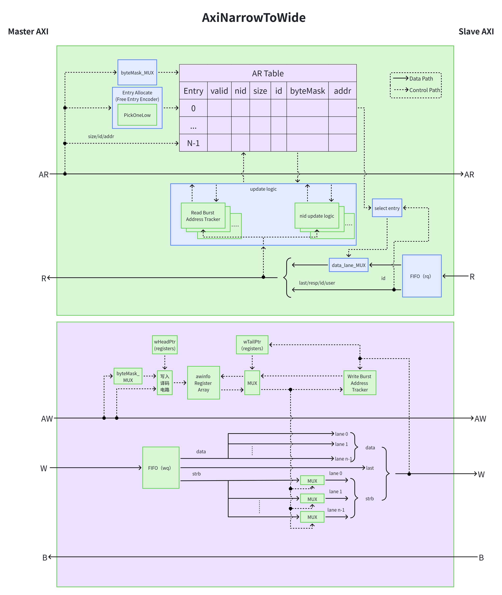
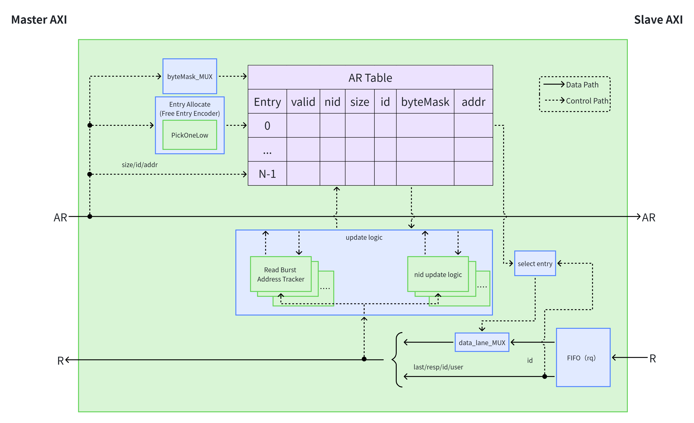
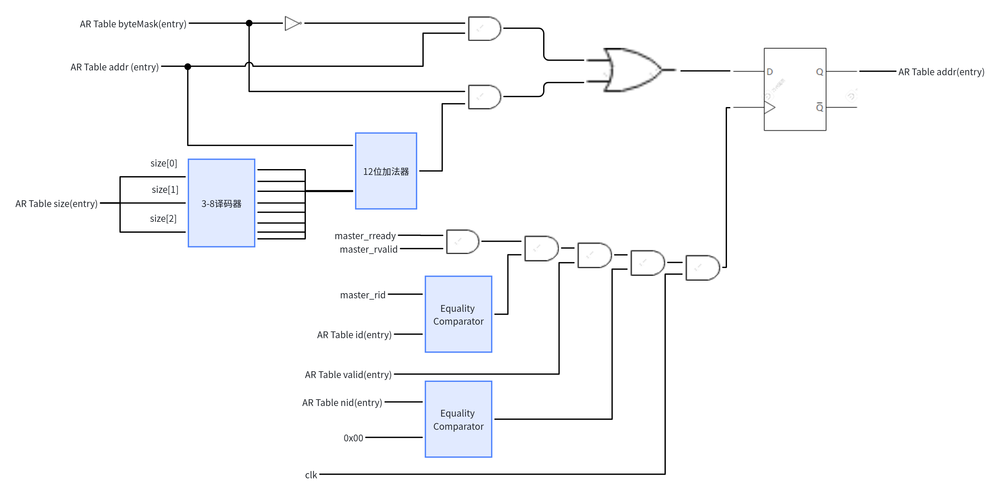
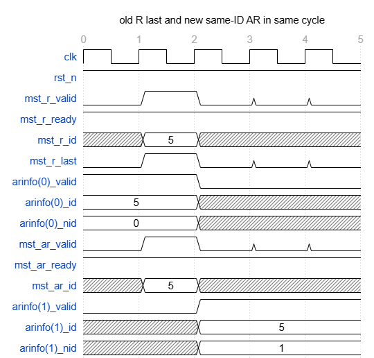
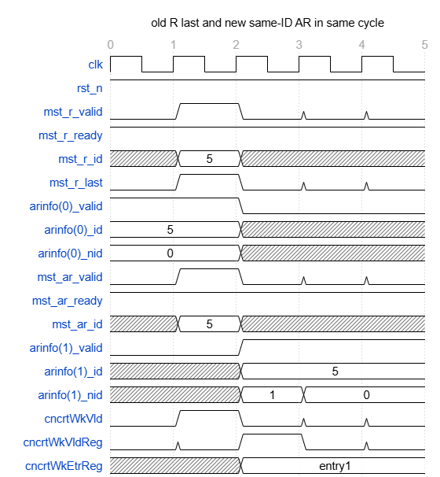
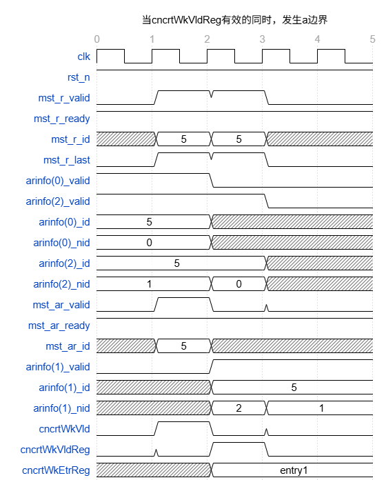
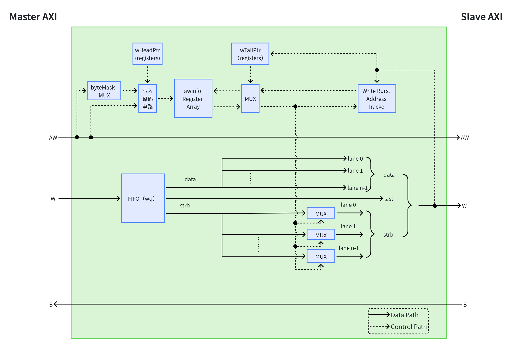

# DS-ZhujiangNG-AxiNarrowToWide

---

## 文档审批信息

| 角色 | 签名 |
|------|------|
| 编写 |      |
| 校对 |      |
| 审核 |      |
| 批准 |      |
| 日期 |      |

## 文档修订记录

| 序号 | 版本编号 | 状态变化 | 更变说明 | 源码基线 commit | 作者 | 日期 |
|------|----------|----------|----------|----------------|------|------|
| 1 | 待定 | C | 创建 AxiNarrowToWide 设计说明 |  | AxiNarrowToWide.scala | 2026.08.20 |

> 状态变化：C——创建，A——增加，M——修改，D——删除

### 变更明细

#### 待定 (2026.08.20)

- [A] 创建 AxiNarrowToWide 模块设计规格、总体设计、详细设计、PPA 说明和验证关注点 → [§1](#1-简介)

---

## 目录

- [1. 简介](#1-简介)
- [2. 设计规格](#2-设计规格)
- [3. 功能描述](#3-功能描述)
- [4. 总体设计](#4-总体设计)
- [5. 详细设计](#5-详细设计)
- [6. PPA 优化设计](#6-ppa-优化设计)
- [7. 验证关注点](#7-验证关注点)
- [8. Floorplan 建议](#8-floorplan-建议)
- [9. 遗留问题](#9-遗留问题)

---

## 1. 简介

### 1.1 文档介绍

本文档描述 AxiNarrowToWide 是一个 AXI 数据位宽转换模块，用于连接窄数据位宽的上游 Master 接口和宽数据位宽的下游 Slave 接口。模块仅改变 AXI 数据通道的物理位宽，不改变事务的传输粒度和 beat 数量。

本文档覆盖参数约束、接口行为、写地址信息表、W 数据 FIFO、读请求信息表、R 数据 FIFO、地址跟踪、lane 选择、握手关系、PPA 特征和验证关注点。本文档描述的是当前 RTL 的实现。

> **📝 评审意见：**
>
> _（请在此处填写评审意见）_

### 1.2 术语说明

| 缩写 | 全称 | 描述 |
|---|---|---|
| AXI | Advanced eXtensible Interface | Arm AMBA 总线协议族中的高性能内存映射接口 |
| AR | AXI Read Address | 读地址通道 |
| R | AXI Read Data | 读数据响应通道 |
| AW | AXI Write Address | 写地址通道 |
| W | AXI Write Data | 写数据通道 |
| B | AXI Write Response | 写响应通道 |
| ID | Transaction Identifier | AXI 事务标识 |
| beat | Burst transfer beat | 一次 AXI 数据传输；本模块不把多个窄侧 beat 合并为一个宽侧 beat |
| lane | Sub-word position | 宽侧数据中的一个窄侧字节/数据段位置 |
| `AWINFO` | Write address information table | 保存 AW 元数据和当前写地址状态的寄存器阵列 |
| `ARINFO` | Read address information table | 保存 AR 元数据、当前读地址和同 ID 顺序计数的寄存器阵列 |
| `nid` | Number of same-ID predecessors | 同 ID 前序读事务计数；当前实现只用于读侧响应选择和顺序跟踪 |
| `fire` | `valid && ready` | Decoupled 接口一次成功握手 |
| `seg` | Segment count | `slvParams.dataBits / mstParams.dataBits`，宽侧包含的窄侧数据段数量 |

> **📝 评审意见：**
>
> _（请在此处填写评审意见）_

## 2. 设计规格

### 2.1 参数约束

| 参数 | 含义和 RTL 用途 | 约束/默认行为 |
|---|---|---|
| `mstParams.dataBits` | Master 侧数据总线宽度，即窄侧 `WDATA/RDATA` 的位宽；同时决定窄侧 `WSTRB` 宽度 `dataBits / 8`。 | 必须不大于 `slvParams.dataBits`；源码通过 `require(mstParams.dataBits <= slvParams.dataBits)` 检查。 |
| `slvParams.dataBits` | Slave 侧数据总线宽度，即宽侧 `WDATA/RDATA` 的位宽。 | 应大于或等于 `mstParams.dataBits`。 |
| `buffer` | AWINFO/ARINFO 表项数量，表示最多可保存的写地址元数据和读地址事务数量。 | 工程集成建议 `buffer >= 2`；当前 W FIFO 深度固定为 2，`buffer` 本身不是 W FIFO 深度。 |
| `mstParams.idBits`、`slvParams.idBits` | AXI 事务 ID 的位宽。ID 用于 ARINFO 的响应匹配；AW/B 侧 ID 直接透传。 | 必须相等；模块不进行 ID 重映射，源码通过 `require(mstParams.idBits == slvParams.idBits)` 检查。 |
| `mstParams.addrBits`、`slvParams.addrBits` | AXI 地址字段的位宽。AW/AR 地址字段整体直通，但内部主要跟踪低 12 位地址。 | 地址位宽应至少能支持代码中的 `addr(11, 0)` 切片，通常为 32、40 或 48 位；当前 RTL 未显式检查 `addrBits >= 12`。 |
| `mstParams.lenBits` | AWLEN/ARLEN 字段的位宽，表示 burst 长度减一。 | 应符合 AXI 配置，通常为 8 位；本模块保持 `LEN` 直通。 |
| `mstParams.sizeBits` | AWSIZE/ARSIZE 字段的位宽，表示每个 beat 的字节数为 `2^size`。 | 通常为 3 位，对应 AXI4 的 `size` 范围；本模块保持 `SIZE` 直通。 |
| `mstParams.burstBits` | AWBURST/ARBURST 字段的位宽，用于区分 FIXED、INCR 和 WRAP。 | 通常为 2 位；本模块保持 `BURST` 直通，并依据其值计算 `byteMask`。 |
| `mstParams.lastBits`、`slvParams.lastBits` | `WFlit.last` 和 `RFlit.last` 字段的位宽，对应 AXI 的 WLAST/RLAST。 | Master 和 Slave 均要求非零；源码通过 `require` 检查。标准 AXI 通常为 1 位；若大于 1，当前 `_last` 只使用 bit0。 |
| 数据位宽比例 `seg = sdw / mdw` | 宽侧包含的窄侧数据段数量，也是 WDATA 复制次数和 RDATA lane 数量。 | RTL 使用 Scala 整数除法，集成应保证 `sdw` 是 `mdw` 的整数倍；通常使用 2 的幂次位宽。当前 RTL 未显式检查整除。 |
| 地址范围和 4KB 边界 | AXI burst 的地址活动范围及内部地址跟踪范围。 | burst 不应跨越 AXI 4KB 边界；内部 `AWINFO/ARINFO` 主要保存和更新 `addr[11:0]`，当前 RTL 未对跨界输入报错。 |

RTL 中的显式约束为：

```scala
require(mstParams.lastBits != 0)
require(slvParams.lastBits != 0)
require(mstParams.dataBits <= slvParams.dataBits)
require(mstParams.idBits == slvParams.idBits)
```

`dataBits` 比例为整数、`buffer >= 2`、burst 合法性和 4KB 边界属于集成与验证约束，当前 RTL 未全部通过 `require` 显式检查。

### 2.2 接口规格

| 通道 | 方向 | 描述 |
|---|---|---|
| `mst.aw` | 上游 -> 模块 | 接收窄侧写地址和 burst 参数；成功握手时写入 AWINFO，并把 AW 原样转发到下游 |
| `mst.w` | 上游 -> 模块 | 接收窄侧写数据、`WSTRB`、`WLAST` 和 `USER`，进入深度为 2 的 W FIFO |
| `mst.b` | 模块 -> 上游 | 接收下游 B 响应并直接返回上游，不修改 ID |
| `mst.ar` | 上游 -> 模块 | 接收窄侧读地址，分配 ARINFO 表项后原样转发到下游 |
| `mst.r` | 模块 -> 上游 | 接收下游 R 响应，经 R FIFO 缓冲并按地址选择一个窄侧数据 lane |
| `slv.aw` | 模块 -> 下游 | AW 参数直通，不改变地址、长度、size、burst 或 ID |
| `slv.w` | 模块 -> 下游 | 输出复制后的宽侧 `WDATA`、lane 选择后的 `WSTRB` 和原始 `WLAST` |
| `slv.b` | 下游 -> 模块 | 下游写响应，直接连接到上游 B 通道 |
| `slv.ar` | 模块 -> 下游 | AR 参数直通；只有有空闲 ARINFO 表项时才允许握手 |
| `slv.r` | 下游 -> 模块 | 宽侧读数据进入深度为 1 的 R FIFO |

`AW/AR` 的 `addr、len、size、burst` 不因位宽转换而改变；本模块不是宽侧 beat 聚合器，也不会把一个窄侧 burst 拆成多个地址事务。

> **📝 评审意见：**
>
> _（请在此处填写评审意见）_

---

## 3. 功能描述

**功能描述：** 模块保持输入事务的 beat 数量及每 beat 有效字节数不变，只适配物理数据总线宽度。写方向将窄 WDATA 连接到宽数据总线的所有 lane，通过 WSTRB 只使能地址对应的目标 lane。读方向将宽 RDATA 切分成多个窄 lane，再根据对应 AR 的当前地址选择一个 lane 返回上游。

> **📝 评审意见：**
>
> _（请在此处填写评审意见）_

---

## 4. 总体设计

### 4.1 整体框图


*图 4.1  AxiNarrowToWide 模块总体框图*

### 4.2 内部状态元素

| 状态元素 | 类型/深度 | 作用 |
|---|---|---|
| `awinfo` | `Reg(Vec(buffer, AxiWidthWCvtBundle))` | 保存 AW 的 `addr、size、id、byteMask`；当前 tail 表项的 `addr` 会随 W beat 更新 |
| `wHeadPtr` | 环形指针 | 指向下一个 AWINFO 写入位置 |
| `wTailPtr` | 环形指针 | 指向当前正在发送 W 的 AWINFO 表项 |
| `wq` | `FastQueue(WFlit, 2)` | 缓冲窄侧 W 数据 |
| `valid` | `Vec(buffer, Bool)` | 标记 ARINFO 表项是否有效 |
| `arinfo` | `Reg(Vec(buffer, AxiWidthRCvtBundle))` | 保存 AR 元数据、低 12 位地址和 `nid` |
| `rq` | `Queue(RFlit, 1)` | 缓冲宽侧 R 响应，隔离下游 R 与上游 R ready |
| `cncrtWkVldReg` | `RegNext` | 处理 R 完成与同周期新 AR 的 `nid` 边界 |
| `cncrtWkEtrReg` | `RegEnable` | 记录边界周期新 AR 写入的 ARINFO 表项 |

> **📝 评审意见：**
>
> _（请在此处填写评审意见）_

---

## 5. 详细设计

该模块主要解决窄位宽master和宽位宽slave之间的数据位宽不匹配的问题。在宽侧执行 AXI narrow transfer，因此 AW/AR 的 addr、size、len 基本保持不变。然后通过事务地址跟踪确定宽总线中的目标 lane，再对写数据进行 lane 定位、对读数据进行 lane 提取。

## **AR/R通道**



### AR：

- AR索引表：用于索引R通道乱序返回对应的事务信息并更新每一beat对应的地址，表包括valid、nid、size、id、byteMask、addr信息。

    - byteMask主要是根据burst、size、len类型生成offset addr对应掩码，用于addr更新。burst为fixed时，byteMask是0x00；burst为wrap时，byteMask是2^size \*（len\+1）\- 1;burst为inrc时，byteMask是0xFFF。

    - addr是动态地址，对应每一拍R通道数据的地址。R通道master侧每完成一次握手，AR索引表对应事务的addr会进行对应更新。

- AR握手:表内有空余，AR通道才能握手。握手成功后，master的发送AR信息给slave并在AR索引表中记录对应信息。

### R:

- slave侧：FIFO非满，slave\_rready拉高，等待握手，握手成功后将R通道数据压入FIFO。

- master侧：

    - FIFO非空，master\_rvalid拉高，等待握手，握手成功后将R通道数据弹出FIFO。

    - 根据id查表获得对应事务的addr，然后根据当前拍的addr选择宽侧数据对应的data\_lane作为窄侧数据输出。

    - 位宽转换规则：宽侧数据位宽是sdw，窄侧数据位宽是mdw，两者在模块定义时必须是2的倍数并且sdw/mdw为整数。将宽侧数据分成sdw/mdw个data\_lane。根据AXI窄传输规则，使用当前拍的addr\[log2\(sdw/8\) \- 1:log2\(mdw/8\)\]作为data\_lane的索引，通过该索引选择对应的data\_lane作为窄侧的数据。

### AR Table：

- Read burst address tracker：master侧R通道握手成功时，根据握手的id确定AR表项中的事务。然后获得size用来计算每一拍的地址增量2^size，\~byteMask与addr相与获得基地址，byteMask与addr\+2^size相与获得偏移地址。基地址与偏移地址相或获得新地址。



- nid update logic：

    - AR通道握手成功，统计当前已有相同 ID 的读事务数量，写入 nid。

    - 当 master R 通道返回某个读事务的最后一个数据且握手成功时，表示该读事务已经完成。随后模块遍历所有有效的 AR 表表项，对保存了相同ID 且 nid 非 0 的表项执行 nid \- 1。这里的 nid 表示该表项前方尚未完成的同 ID 读事务数量。因此，每完成一个同 ID 的前序读事务，后续同 ID 事务的 nid 就会减少 1。

    - 两种nid更新的边界条件：（该边界目前通过 cncrtWkVldReg/cncrtWkEtrReg 下一拍修正 nid。理论上也可考虑在 nid 计算路径中直接扣除同周期完成项，但需要进一步评估组合路径和更新优先级。实现方法：在原来更新nid的时序逻辑中增加新的条件判断来处理，这样仅是增加了电路的开关信号，没有引入新的寄存器）

        - 当master R通道的最后一个数据返回的同时，master AR通道发送了一笔同id的读事务。

            - master R通道最后一笔数据在第二个上升沿握手成功，master也在第二个上升沿发来同id读事务，称该边界为a边界。由于寄存器，arinfo\(1\)会记录到与arinfo\(0\)是同id，所以arinfo\(1\)\_nid会为1。但是由于nid更新条件，所以会导致arinfo\(1\)\_nid不会在变为0。因此需要为这个边界加入一些指示信号。



                ```JSON
                {
                  "signal": [
                    { "name": "clk", "wave": "p...." },
                    { "name": "rst_n", "wave": "1...." },
                
                    { "name": "mst_r_valid", "wave": "01000" },
                    { "name": "mst_r_ready", "wave": "1...." },
                    { "name": "mst_r_id", "wave": "x=xxx", "data": ["5"] },
                    { "name": "mst_r_last", "wave": "01000" },
                
                    { "name": "arinfo(0)_valid", "wave": "1.0.." },
                    { "name": "arinfo(0)_id", "wave": "=.xxx", "data": ["5"] },
                    { "name": "arinfo(0)_nid", "wave": "=.xxx", "data": ["0"] },
                
                    { "name": "mst_ar_valid", "wave": "01000" },
                    { "name": "mst_ar_ready", "wave": "1...." },
                    { "name": "mst_ar_id", "wave": "x=xxx", "data": ["5"] },
                
                    { "name": "arinfo(1)_valid", "wave": "0.1.." },
                    { "name": "arinfo(1)_id", "wave": "xx=..", "data": ["5"] },
                    { "name": "arinfo(1)_nid", "wave": "xx=..", "data": ["1"] },
                  ],
                  "config": {
                    "hscale": 2
                  },
                  "head": {
                    "text": "old R last and new same-ID AR in same cycle",
                    "tick": 0
                  }
                }
                ```

            - 加入cncrtWkVld、cncrtWkVldReg和cncrtWkEtrReg信号，用于处理a边界。

                - cncrtWkVld是组合逻辑

                ```Scala
                cncrtWkVld=(mst_r_valid && mst_r_ready) && (mst_ar_valid && mst_ar_ready) && mst_r_last && mst_ar_id === mst_r_id
                ```

                - cncrtWkVldReg是对cncrtWkVld信号打一拍，主要为指示对哪一个表项的nid进行减一。

                - cncrtWkEtrReg是寄存器，主要在cncrtWkVld有效时，保存master AR通道的读事务填入AR表的哪一个表项，为下一拍，对该表项的nid进行减一。



                ```JSON
                {
                  "signal": [
                    { "name": "clk", "wave": "p...." },
                    { "name": "rst_n", "wave": "1...." },
                
                    { "name": "mst_r_valid", "wave": "01000" },
                    { "name": "mst_r_ready", "wave": "1...." },
                    { "name": "mst_r_id", "wave": "x=xxx", "data": ["5"] },
                    { "name": "mst_r_last", "wave": "01000" },
                
                    { "name": "arinfo(0)_valid", "wave": "1.0.." },
                    { "name": "arinfo(0)_id", "wave": "=.xxx", "data": ["5"] },
                    { "name": "arinfo(0)_nid", "wave": "=.xxx", "data": ["0"] },
                
                    { "name": "mst_ar_valid", "wave": "01000" },
                    { "name": "mst_ar_ready", "wave": "1...." },
                    { "name": "mst_ar_id", "wave": "x=xxx", "data": ["5"] },
                
                    { "name": "arinfo(1)_valid", "wave": "0.1.." },
                    { "name": "arinfo(1)_id", "wave": "xx=..", "data": ["5"] },
                    { "name": "arinfo(1)_nid", "wave": "xx==.", "data": ["1","0"] },
                
                    { "name": "cncrtWkVld", "wave": "01000" },
                    { "name": "cncrtWkVldReg", "wave": "00100" },
                    { "name": "cncrtWkEtrReg", "wave": "xx=..", "data": ["entry1"] }
                  ],
                  "config": {
                    "hscale": 2
                  },
                  "head": {
                    "text": "old R last and new same-ID AR in same cycle",
                    "tick": 0
                  }
                }
                ```

        - 当cncrtWkVldReg有效的同时，发生a边界。

            - 在第三个上升沿，如果按a边界条件下考虑，就会导致其只减一。



                ```JSON
                {
                  "signal": [
                    { "name": "clk", "wave": "p...." },
                    { "name": "rst_n", "wave": "1...." },
                
                    { "name": "mst_r_valid", "wave": "0110." },
                    { "name": "mst_r_ready", "wave": "1...." },
                    { "name": "mst_r_id", "wave": "x==xx", "data": ["5", "5"] },
                    { "name": "mst_r_last", "wave": "0110." },
                    
                    { "name": "arinfo(0)_valid", "wave": "1.0.." },
                    { "name": "arinfo(2)_valid", "wave": "1..0." },
                    { "name": "arinfo(0)_id", "wave": "=.xxx", "data": ["5"] },
                    { "name": "arinfo(0)_nid", "wave": "=.xxx", "data": ["0"] },
                    { "name": "arinfo(2)_id", "wave": "=..xx", "data": ["5"] },
                    { "name": "arinfo(2)_nid", "wave": "=.=xx", "data": ["1","0"] },
                
                    { "name": "mst_ar_valid", "wave": "0100." },
                    { "name": "mst_ar_ready", "wave": "1...." },
                    { "name": "mst_ar_id", "wave": "x=xxx", "data": ["5"] },
                
                
                    { "name": "arinfo(1)_valid", "wave": "0.1.." },
                
                    { "name": "arinfo(1)_id", "wave": "x.=..", "data": ["5"] },
                
                    { "name": "arinfo(1)_nid", "wave": "x.==.", "data": ["2", "1"] },
                
                    { "name": "cncrtWkVld", "wave": "0100." },
                    { "name": "cncrtWkVldReg", "wave": "0010." },
                    { "name": "cncrtWkEtrReg", "wave": "x.=..", "data": ["entry1"] },
                
                  ],
                  "edge": [
                    "cncrtWkVld~>cncrtWkVldReg delay 1 cycle",
                    "double_dec_hit~>arinfo(entry1).nid decrement by 2",
                    "arinfo(entry1).nid~>arShouldSend(entry1) nid becomes 0"
                  ],
                  "config": {
                    "hscale": 2
                  },
                  "head": {
                    "text": "当cncrtWkVldReg有效的同时，发生a边界",
                    "tick": 0,
                  }
                }
                ```

            - 因此在其条件判断语句中需要加入此种情况，在此种边界情况下，对nid进行减2\.


                ```JSON
                {
                  "signal": [
                    { "name": "clk", "wave": "p...." },
                    { "name": "rst_n", "wave": "1...." },
                
                    { "name": "mst_r_valid", "wave": "0110." },
                    { "name": "mst_r_ready", "wave": "1...." },
                    { "name": "mst_r_id", "wave": "x==xx", "data": ["5", "5"] },
                    { "name": "mst_r_last", "wave": "0110." },
                    
                    { "name": "arinfo(0)_valid", "wave": "1.0.." },
                    { "name": "arinfo(2)_valid", "wave": "1..0." },
                    { "name": "arinfo(0)_id", "wave": "=.xxx", "data": ["5"] },
                    { "name": "arinfo(0)_nid", "wave": "=.xxx", "data": ["0"] },
                    { "name": "arinfo(2)_id", "wave": "=..xx", "data": ["5"] },
                    { "name": "arinfo(2)_nid", "wave": "=.=xx", "data": ["1","0"] },
                
                    { "name": "mst_ar_valid", "wave": "0100." },
                    { "name": "mst_ar_ready", "wave": "1...." },
                    { "name": "mst_ar_id", "wave": "x=xxx", "data": ["5"] },
                
                
                    { "name": "arinfo(1)_valid", "wave": "0.1.." },
                
                    { "name": "arinfo(1)_id", "wave": "x.=..", "data": ["5"] },
                
                    { "name": "arinfo(1)_nid", "wave": "x.==.", "data": ["2", "0"] },
                
                    { "name": "cncrtWkVld", "wave": "0100." },
                    { "name": "cncrtWkVldReg", "wave": "0010." },
                    { "name": "cncrtWkEtrReg", "wave": "x.=..", "data": ["entry1"] },
                
                  ],
                  "edge": [
                    "cncrtWkVld~>cncrtWkVldReg delay 1 cycle",
                    "double_dec_hit~>arinfo(entry1).nid decrement by 2",
                    "arinfo(entry1).nid~>arShouldSend(entry1) nid becomes 0"
                  ],
                  "config": {
                    "hscale": 2
                  },
                  "head": {
                    "text": "当cncrtWkVldReg有效的同时，发生a边界",
                    "tick": 0,
                  }
                }
                ```

## **AW/W/B通道**



### AW：

- awinfo Register Array：用于记录AW的通道的addr、size、id、byteMask信息。

    - byteMask主要是根据burst、size、len类型生成offset addr对应掩码，用于addr更新。burst为fixed时，byteMask是0x00；burst为wrap时，byteMask是2^size \*（len\+1）\- 1;burst为inrc时，byteMask是0xFFF。

    - AW握手成功时，根据头指针寄存器的值将需要记录的 AW 信息写入对应的 awinfo\(i\) 寄存器并改变头指针寄存器值。

    - slave侧的W通道握手成功并且last信号有效，尾指针寄存器值改变。

- Write Burst Address Tracker：追踪W通道每拍数据的地址。

    - W通道每拍握手前，通过尾指针寄存器和MUX电路获取当拍地址信息、size和byteMask，并计算下一拍的地址信息。size用来计算每一拍的地址增量2^size，\~byteMask与addr相与获得基地址，byteMask与addr\+2^size相与获得偏移地址。基地址与偏移地址相或获得新地址。

    - W通道每拍握手时，将计算的新地址写入尾指针指示的 awinfo\(i\) 寄存器中。

- AW握手：awinfo非满时，AW通道才能进行握手。握手成功后，master将AW通道信息直接传给slave。

### W：

- master侧：wq FIFO未满时，mst\_wready有效，握手成功后，将W信息压入FIFO。

- slave侧：wq FIFO未空时，slave\_wvalid有效，握手成功后，将W信息弹出FIFO。

    - data扩展成n个lane作为slave侧的data。

    - strb也扩展成n个lane作为slave侧的strb，但是会根据从Write Burst Address Tracker获得的当拍地址来选择对应lane输出窄侧strb的值，其他未被选择lane输出0x00。

    - strb选择规则：宽侧数据位宽是sdw，窄侧数据位宽是mdw，两者在模块定义时必须是2的倍数并且sdw/mdw为整数。将宽侧数据分成sdw/mdw个strb\_lane。根据AXI窄传输规则，使用当前拍的addr\[log2\(sdw/8\) \- 1:log2\(mdw/8\)\]作为strb\_lane的索引，通过该索引选择对应的strb\_lane。

### B：

- master的B通道和slave的B通道直接直连透传。


> **📝 评审意见：**
>
> _（请在此处填写评审意见）_

---

## 6. PPA 优化设计


> **📝 评审意见：**
>
> _（请在此处填写评审意见）_

---

## 7. 验证关注点

### 7.1 复位

- 复位后验证：
    - AWINFO/ARINFO 无有效事务，ARINFO的valid为0。
    - W/R FIFO 为空。
    - wHeadPtr和wTailPtr指针回到初始值。
    - 不产生虚假的AW、AR、W、R、B事务。

### 7.2 AW/W/B 写通道

- AW 所有字段在下游保持不变，只有成功握手时写入 AWINFO。
- AWINFO 满时 `mst.aw.ready` 和 `slv.aw.valid` 的行为正确。
- AW 先于 W、W 先于 AW、AW/W 同周期到达均不丢事务。
- W FIFO 满/空、入队/出队同时发生、下游 W backpressure 均正确。
- WDATA 在所有宽侧 lane 复制一致。
- lane 0 到 lane `seg-1` 的 WSTRB 选择全部覆盖；未选 lane 必须为零。
- `WSTRB` 全零、全一、单字节和非连续模式均正确。
- `W.fire` 才更新地址，`WLAST.fire` 才推进 `wTailPtr`。
- FIXED、INCR、WRAP burst 的地址、lane 和 WLAST 行为正确。
- 写响应 B 的 ID、RESP、USER 直通且不丢失；明确验证环境对 B 顺序的外部保序假设。

### 7.3 AR/R 读通道

- AR 所有字段直通；无空闲 ARINFO 时阻止 AR 握手。
- `PickOneLow` 按最低空闲表项分配，表项不会重复占用。
- 单 ID、多 ID、相同 ID 多笔 outstanding 和混合 ID 均覆盖。
- nid 统计正确；旧同 ID R.last 返回后，后续表项的 nid 正确减少。
- R FIFO 满、空、R 入队和上游 R 出队同时发生时无丢失或重复。
- R 被反压时地址不更新、ARINFO 不提前释放。
- 所有宽侧 RDATA lane 选择正确，R 的 ID、RESP、LAST、USER 不被破坏。
- 读 burst 的 FIXED、INCR、WRAP 地址和 lane 选择正确。

### 7.4 并发和边界

- AW.fire 与 W.fire 同周期。
- WLAST.fire 与新 AW.fire 同周期。
- AR.fire 与 R.last.fire 同周期，尤其是相同 ID。
- R FIFO 入队与 R FIFO 出队同周期。
- 所有通道随机 ready/valid 反压下无丢失、重复、提前释放或数据不稳定。
- 地址位于 4KB 边界附近时，验证输入约束和内部低 12 位更新行为。

> **📝 评审意见：**
>
> _（请在此处填写评审意见）_

---

## 8. Floorplan 建议


> **📝 评审意见：**
>
> _（请在此处填写评审意见）_

---

## 9. 遗留问题


> **📝 评审意见：**
>
> _（请在此处填写评审意见）_

---
